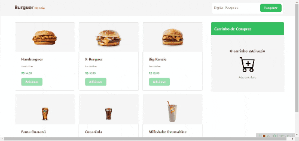

<h1>💻 HAMBURGUERIA</h1>

 

A Hambugueira é uma simulação de um e-ecommerce em React com consumo de API. O usuário pode inserir produtos no carrinho, verificar o valor e excluir itens. É possível pesquisar produtos de forma dinâmica, através da barra de pesquisa, e um alerta surge caso um produto que já esteja no carrinho tente ser adicionado novamente.
 

<h1>🔨 RECURSOS</h1>

<ul>
<li><strong>Lista de produtos:</strong> os produtos fornecidos pela API são listados para o usuário.</li>
<li><strong>Adicionar ao carrinho:</strong> o usuário pode inserir produtos ao carrinho.</li>
<li><strong>Remover do carrinho:</strong> o usuário pode remover produtos do carrinho.</li>
<li><strong>Carrinho compras:</strong> é possível visualizar o resumo da compra e o valor total dinamicamente.</li>
<li><strong>Barra de pesquisa:</strong> é possível pesquisar produtos dinamicamente através da barra de pesquisa.</li>
<li><strong>Alerta:</strong> caso o usuário tente colocar o mesmo produto duas vezes, surgi um alerta indicando que o produto se encontra no carrinho.</li>
<li><strong>Aplicação responsiva.</strong></li>
</ul> 

<h1>🚀 TECNOLOGIAS</h1>

<ul>
<li>JAVASCRIPT</li>
<li>HTML</li>
<li>CCS</li>
<li>REACT</li>
<li>CONSUMO DE API</li>
<li>AXIOS</li>
<li>STYLED-COMPONENTS</li>
</ul> 

<h1>🔗 LINK</h1>

<a href="https://react-entrega-s1-hamburgueria-da-kenzie-elizeu-vasconcelos1992.vercel.app/" target="_blank">LINK PARA A HAMBURGUERIA</a>
